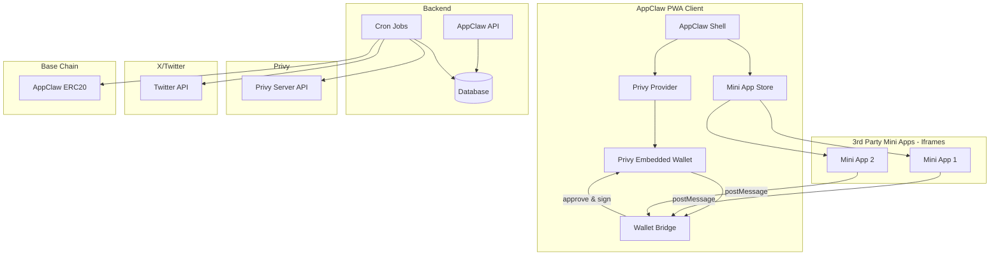
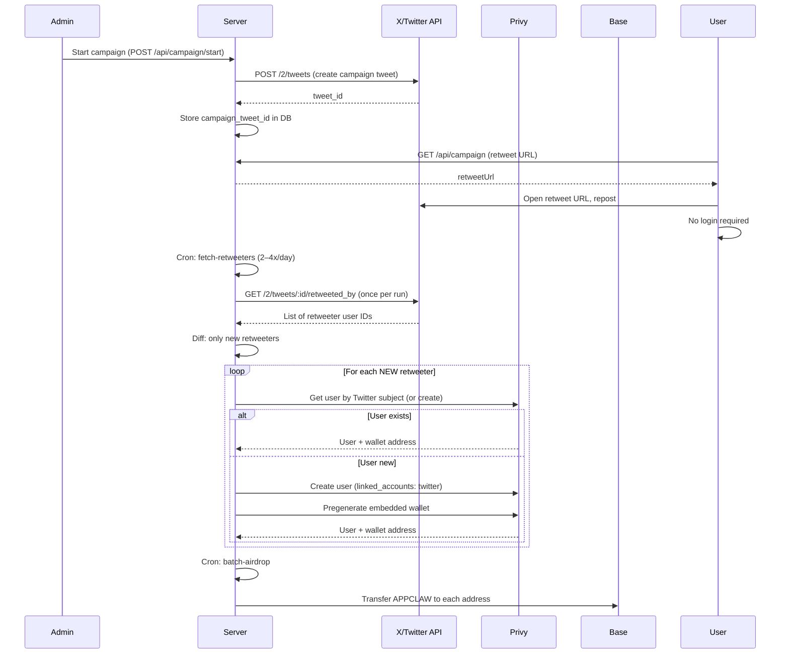

# AppClaw Plan: Privy + Iframe Bridge + Retweet Airdrop

## Summary of Changes

| Before | After |
|--------|-------|
| Porto wallet | Privy (Twitter-only login) |
| Privy Global Wallet (3rd party adds AppClaw to RainbowKit) | **postMessage bridge** (parent has Privy, iframe receives wallet via bridge) |
| PWA install required for airdrop | No PWA requirement |
| Tweet format `#AppClaw 0x...` to register | Retweet campaign tweet only |
| Fetch tweets by search, parse addresses | Fetch retweeters of campaign tweet |
| Wallet addresses from user tweets | Privy pre-creates user + wallet for each retweeter (Twitter subject) |

---

## 1. Architecture Overview



---

## 2. Privy + Iframe Bridge

### 2.1 Design Principles

- **Privy stays in the parent**: User logs in once via Twitter. Wallet lives in AppClaw shell.
- **Mini apps run in iframes**: Cross-origin isolation. Mini apps cannot access parent's DOM or wallet directly.
- **postMessage bridge**: Mini app sends requests; parent validates, shows confirmation, executes via Privy, returns result.

### 2.2 Security Benefits

- No re-login when opening mini apps (session is in parent).
- Malicious mini app cannot drain wallet: it can only request; parent controls execution.
- Every sign/send goes through parent's confirmation UI.

### 2.3 Bridge Protocol

**Mini app → Parent (request):**

| type | payload | description |
|------|---------|-------------|
| `APPCLAW_GET_WALLET` | — | Request wallet address |
| `APPCLAW_SIGN_MESSAGE` | `{ message: string }` | Request personal_sign |
| `APPCLAW_SEND_TX` | `{ to, value, data?, gasLimit? }` | Request transaction |

**Parent → Mini app (response):**

| type | payload | description |
|------|---------|-------------|
| `APPCLAW_WALLET` | `{ address }` | Wallet address |
| `APPCLAW_SIGN_RESULT` | `{ signature }` | Signed message |
| `APPCLAW_TX_RESULT` | `{ hash }` | Transaction hash |
| `APPCLAW_ERROR` | `{ code, message }` | Error |

### 2.4 Mini App SDK

Mini apps include a script and use a simple API:

```html
<script src="https://appclaw.xyz/sdk/appclaw.js"></script>
<script>
  AppClaw.getWallet().then(addr => console.log(addr))
  AppClaw.signMessage('Hello').then(sig => console.log(sig))
  AppClaw.sendTransaction({ to: '0x...', value: '0' }).then(hash => console.log(hash))
</script>
```

---

## 3. Retweet Airdrop Flow (Repost — max viral, minimal X API cost)

- **One campaign tweet**; users **repost (retweet)** to qualify. No search, no strict-format posts.
- **UX:** In-app “Repost to claim” button uses pre-filled retweet URL from `GET /api/campaign` (one tap to X).
- **X API cost:** One `POST /2/tweets` when starting campaign; cron runs `GET /2/tweets/:id/retweeted_by` once per run. Run cron **2–4x per day** (e.g. 0:00, 6:00, 12:00, 18:00 UTC) so cost stays low and eligibility is still within hours.
- **Optimization:** fetch-retweeters only processes **new** retweeters (skips already-registered Twitter IDs), so Privy and DB work are minimized on each run.



### 3.1 Cost minimization (X pay-per-use)

- **Cron frequency:** Run fetch-retweeters **2–4x per day** (e.g. 0:00, 6:00, 12:00, 18:00 UTC). Avoid running every few minutes.
- **One API read per run:** Single `GET /2/tweets/:id/retweeted_by` (paginated); no search, no per-user lookups.
- **Only new retweeters:** Script diffs against existing AirdropRegistration and only creates Privy users + DB rows for new Twitter IDs.

---

## 4. Data Models

| Entity | Key Fields |
|--------|------------|
| **Campaign** | id, campaignTweetId, status, createdAt |
| **AirdropRegistration** | id, twitterUserId, twitterUsername, privyUserId, walletAddress, airdroppedAt, amount |
| **MiniApp** | (unchanged) url, name, description, etc. |

---

## 5. File Structure

```
AppClaw/
├── app/
│   ├── api/
│   │   ├── campaign/
│   │   │   ├── route.ts         # GET: current campaign + retweet URL
│   │   │   └── start/route.ts   # POST: create campaign tweet
│   │   └── miniapps/
│   ├── app/
│   │   ├── [id]/page.tsx
│   │   └── view/page.tsx    # iframe + bridge
├── lib/
│   ├── privy-config.ts
│   ├── privy-server.ts
│   ├── wallet-context.tsx
│   └── wallet-bridge.ts     # parent postMessage listener
├── components/
│   ├── airdrop-miniapp.tsx  # "Repost to claim" button + campaign URL
│   └── wallet-bridge-provider.tsx
├── public/
│   └── sdk/
│       └── appclaw.js      # mini app SDK
└── scripts/
    ├── fetch-retweeters.ts  # Only processes new retweeters; run 2–4x/day
    └── batch-airdrop.ts
```

---

## 6. Implementation Phases

1. **Phase 1 – Wallet Bridge**: Create parent listener, extend wallet context with sign/send.
2. **Phase 2 – Bridge Provider**: Wire bridge to view page iframe.
3. **Phase 3 – Mini App SDK**: Create appclaw.js for mini apps.
4. **Phase 4 – Docs**: Update README with bridge integration guide.

---

## 7. References

- [Privy Sign Message](https://docs.privy.io/guide/react/wallets/usage/evm/requests)
- [Privy Send Transaction](https://docs.privy.io/wallets/using-wallets/ethereum/web3-integrations)
- [Window.postMessage](https://developer.mozilla.org/en-US/docs/Web/API/Window/postMessage)
